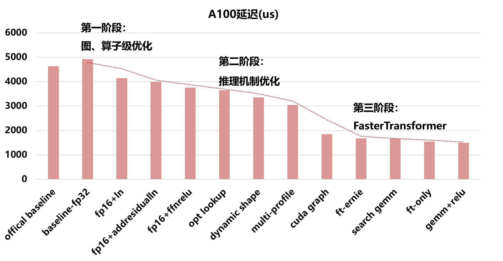

# STI2

## 介绍
百度搜索首届技术创新挑战赛赛道二冠军方案

### 大赛简介
[百度搜索技术创新挑战赛](https://aistudio.baidu.com/aistudio/competition/detail/674/0/introduction)（简称STI）是由百度搜索和百度飞桨共同发起，联合四大区域高校、学会共同举办的一项全国性科技竞赛。本次大赛以“新智能·新搜索”为主题，围绕人工智能、检索技术，为参赛团队提供海量百度搜索脱敏业务数据进行训练及测试。本次大赛面向全国企业、高校、科研机构、项目团队及个人广发英雄帖，旨在挖掘和培育搜索AI人才，促进业内交流、产教融合，推动算法和技术应用创新。

## 目录架构
目录架构说明
```
sti2/
|-- bin
|-- data
|-- docs
|-- include
|   |-- plugins
|   `-- tensorrt
|       `-- include 
|-- model
|-- so
|   |-- plugins
|   `-- tensorrt
|       `-- lib 
|-- src
|   |-- ft_ernie
|   |-- plugins
|   `-- python
|-- tests
|   |-- plugins
|   `-- testAllPlugins.sh
|-- tools
|-- run.sh
|-- build.sh
|-- test.sh
|-- requirements.txt
|-- CMakeLists.txt
|-- README.md
`-- LICENSE
```


## 安装教程

1.  克隆项目
```
git clone https://gitee.com/YukSing12/sti2.git
```
2.  从[官网](https://aistudio.baidu.com/aistudio/competition/detail/674/0/introduction)下载数据集
3.  解压数据集，将数据集下model.onnx  复制到  sti2/model下
4.  准备TensorRT环境(准备NV NGC TensorRT Docker 或者使用AIStudio  基于TensorRT 8.5.1.7 Cuda11.2  cuDnn 8.2)
```
cd sti2
ln -s /[tensorrt dir]/include sti2/include/tensorrt/include
ln -s /[tensorrt dir]/lib sti2/so/tensorrt/lib
or
cp -r /[tensorrt dir]/include sti2/include/tensorrt/include
cp -r /[tensorrt dir]/lib sti2/so/tensorrt/lib
```
5.  安装依赖
```
pip install -r requirements.txt
```

## 使用说明

1.  从paddlepaddle模型导出成onnx模型(可选)
2.  导出模型权重、构建trt引擎、编译可执行文件
```
bash build.sh
```
3.  运行推理
```
bash run.sh data/label.test.txt
bash run.sh data/perf.test.txt
```
4. 本地测试
```
bash test.sh [exe]
```

## 项目特性
<div align="center">
    

    
</div>

### （一）部分算子融合推理
说明：融合算子分为两部分，
1. 改变输入的算子融合,有POSTEMB和DYNAMIC SHAPE两种。
2. 不改变输入的算子融合,有LayernormPlugin、AddResidualLayernormPlugin、EmbLayernormPlugin。</br>
该推理使用[static_trt_infer.cpp](./src/static_trt_infer.cpp) 和 [static_onnx2trt.cpp ](./src/static_onnx2trt.cpp)
### （二）优化推理机制
说明: 此方式采用了multiprofile和cuda graph技术，仅支持第二维为dynamic shape的情况。
该推理使用[dynamic_trt_infer.cpp](./src/dynamic_trt_infer.cpp) 和 [dynamic_onnx2trt.cpp](./src/dynamic_onnx2trt.cpp)
### （三）使用Faster Transformer
说明: 此方式采用了英伟达Faster Transformer框架，分为ft TensorRT Plugin和C++两种推理方式，本项目默认采用C++的方式推理。

[ft_trt_infer.cpp](./src/ft_trt_infer.cpp)和[ft_onnx2trt.cpp](./src/ft_onnx2trt.cpp)将Faster Transformer编译为TensorRT的plugin方式进行推理。

[ft_ernie.cc](.src/ft_ernie/examples/cpp/ernie/ft_infer.cc)仅采用Faster Transformer和C++方式进行推理

## 使用方法
1. 第二维度固定的TRT推理：
```
bash build_static_trt.sh
bash test.sh static_trt_infer
```

2. 第二维度动态的TRT推理:
```
bash build_dynamic_trt.sh
bash test.sh dynamic_trt_infer
```

3. 插入Ernie的TRT推理:
```
bash build_ft_trt.sh
bash test.sh ft_trt_infer
```

4. 基于FT的Ernie推理(默认):
```
bash build.sh
bash test.sh ft_infer
```

## 未来工作
- [ ] int8
- [ ] paddleslim
- [ ] sparse gemm